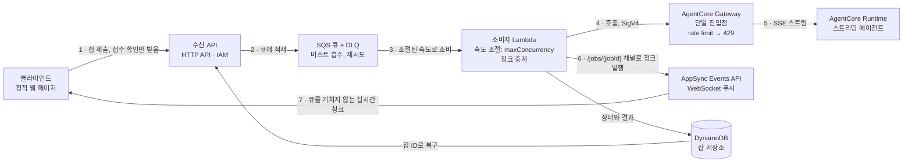

# Amazon Bedrock AgentCore 에이전트 앞에 SQS 버퍼 두기

[English](README.md) | 한국어

**한꺼번에 몰리는 요청은 Amazon SQS로 받아내면서, 클라이언트는 에이전트 응답을 실시간 스트림으로 받는 패턴의 레퍼런스 구현입니다.**

## 어떤 문제를 푸나

[Amazon Bedrock AgentCore Runtime](https://docs.aws.amazon.com/bedrock-agentcore/latest/devguide/what-is-bedrock-agentcore.html)에 스트리밍 에이전트를 올리고, AgentCore Gateway를 단일 진입점으로 두었다고 해봅시다. Gateway는 인증과 rate limit을 제공하지만 **대기열은 없습니다**. 그래서 캠페인이나 배치 유입처럼 요청이 한 번에 몰리면 이런 일이 벌어집니다.

- rate limit을 넘긴 요청은 `429`로 거절되니, 결국 누군가는 재시도를 해야 합니다.
- 재시도를 클라이언트에 맡기면 모든 호출자가 그 복잡성과 실패 처리를 떠안게 됩니다.
- 앞에 큐를 두면 해결될 것 같은데, 이번에는 인터랙티브 UX의 핵심인 **토큰 단위 스트리밍**이 막히는 것처럼 보입니다.

이런 이유로 큐잉과 스트리밍은 같이 가기 어렵다고 여기는 경우가 많습니다. 이 저장소는 둘이 충분히 공존한다는 것을, 실제로 재본 수치와 함께 보여줍니다.

## 핵심 아이디어: 요청 경로와 응답 경로를 나눈다



요청 경로(1~5)가 버스트를 받아내고 속도를 조절하는 동안, 응답 경로(6~7)는 큐를 거치지 않고 곧바로 흘러갑니다.

- **요청 경로**는 SQS를 지납니다. 갑작스러운 유입을 유실 없이 받아두고, 소비자의 `maximumConcurrency`로 처리 속도를 눌러 주며, `429`가 나면 서버가 알려준 `retryAfter`만큼 기다렸다가 시스템 안에서 조용히 다시 시도합니다.
- **응답 경로**는 큐를 지나지 않습니다. 소비자가 Gateway를 통해 에이전트의 SSE 스트림을 읽고, 청크가 도착하는 즉시 클라이언트의 WebSocket 채널로 흘려보냅니다.
- **잡 저장소**는 잡의 수명과 연결의 수명을 떼어놓습니다. 스트리밍 도중 연결이 끊겨도 잡은 끝까지 실행되고, 나중에 잡 ID로 결과를 가져올 수 있습니다.

## 동작 화면


동시 처리 한도가 10인 환경에 잡 20건을 한꺼번에 넣은 화면입니다. 위쪽 스트립은 같은 순간에 스트리밍 중인 잡이 몇 개인지 세는데, 점선으로 표시한 한도를 넘지 않습니다. 회색 막대는 큐에서 차례를 기다린 시간이고, 파란 점은 에이전트가 내보낸 간격 그대로 하나씩 도착하는 청크입니다. 그러면서도 20건 모두 완료됩니다.

[전체 녹화 영상 (41초)](docs/demo.mp4)

## 직접 보고 재볼 수 있는 것

1. **큐를 둬도 스트리밍은 살아 있습니다.** 청크가 마지막에 한꺼번에 몰려오지 않고, 에이전트가 내보낸 간격대로 도착합니다. 화면으로 확인할 수 있고, 수용 테스트가 같은 내용을 수치로 판정합니다.
2. **버퍼링이 어디서 일어나는지 보입니다.** 잡 30건을 한 번에 넣으면 동시 처리 한도만큼만 돌아가고 나머지는 큐에서 기다리는데, 그 과정에서 메시지 유실도 DLQ 적재도 생기지 않습니다.
3. **스로틀이 오류가 아니라 지연으로 바뀝니다.** Gateway rate limit을 낮춰 일부러 초과시켜도 클라이언트에는 `throttled` 상태와 늦게 시작되는 스트림만 보입니다. 완료율은 100%를 유지하고, `429`는 전부 서버 쪽에서 흡수됩니다.
4. **연결이 끊겨도 잡은 살아남습니다.** 스트리밍 도중 WebSocket을 끊어도 잡은 끝까지 실행되고, 잡 ID로 결과를 조회할 수 있습니다.

## 준비물

- `us-west-2`에서 Anthropic Claude Haiku 4.5 [모델 액세스](https://docs.aws.amazon.com/bedrock/latest/userguide/model-access.html)가 활성화된 AWS 계정 (다른 모델을 쓰려면 `infra/cdk.json`의 `modelId`를 바꾸면 됩니다)
- Node.js 18 이상(AWS CDK CLI용), Python 3.11 이상, Docker(ARM64 이미지 빌드용)
- 배포용 AWS 자격증명 (필요한 권한은 아래 [권한](#권한)에 정리해 두었습니다)

## 권한

**배포할 때는** CDK가 IAM 역할, ECR 이미지, Lambda, SQS, DynamoDB, AppSync, AgentCore 리소스를 만들기 때문에, 이 서비스들과 CloudFormation을 다룰 수 있는 폭넓은 관리 권한이 필요합니다. `./scripts/destroy.sh`에는 `logs:DescribeLogGroups`와 `logs:DeleteLogGroup`이 추가로 필요합니다.

**데모와 테스트를 돌릴 때는** 훨씬 적은 권한으로 충분합니다. 아래 정책만 가진 역할로 데모 클라이언트와 수용 테스트, `throttle_demo.py`를 실제로 돌려서 충분하다는 것을 확인했습니다.

```json
{
  "Version": "2012-10-17",
  "Statement": [
    { "Sid": "SubmitAndPollJobs", "Effect": "Allow",
      "Action": "execute-api:Invoke",
      "Resource": "arn:aws:execute-api:us-west-2:<account>:<ingest-api-id>/*" },
    { "Sid": "ReadQueueDepths", "Effect": "Allow",
      "Action": "sqs:GetQueueAttributes",
      "Resource": ["<job-queue-arn>", "<dlq-arn>"] },
    { "Sid": "ThrottleDemo", "Effect": "Allow",
      "Action": ["bedrock-agentcore:ListGatewayRateLimits",
                 "bedrock-agentcore:UpdateGatewayRateLimit"],
      "Resource": "arn:aws:bedrock-agentcore:us-west-2:<account>:gateway/<gateway-id>" }
  ]
}
```

`execute-api:Invoke`는 IAM 인증을 쓰는 수신 API를 호출하는 데 필요합니다. `client/serve.py`가 대신 서명하는 경우든 정적 모드에서 직접 서명하는 경우든 데모 클라이언트가 이 권한을 쓰고, 수용 테스트도 마찬가지입니다. 큐 권한은 시나리오 2에서 DLQ에 쌓인 개수를 읽는 데만 쓰고, rate limit 권한은 시나리오 3과 `throttle_demo.py`에만 씁니다. 이 정책에는 에이전트 자체를 호출할 권한이 전혀 없습니다.

## 배포

```bash
export AWS_REGION=us-west-2
./scripts/deploy.sh
```

명령 한 번으로 ARM64 에이전트 컨테이너를 빌드하고 필요한 리소스를 모두 만듭니다. SQS와 DLQ, DynamoDB, 수신 API, 소비자 Lambda, AgentCore Runtime과 Gateway, rate limit, AppSync Events API가 여기에 포함됩니다. 생성된 엔드포인트는 `outputs/stack-outputs.local.json`에 저장됩니다.

## 데모 실행

```bash
pip install -r tests/requirements.txt
python3 client/serve.py
```

브라우저에서 http://127.0.0.1:8765 을 엽니다. `client/serve.py`가 페이지를 띄우면서 스택 출력값으로 화면을 알아서 채우고, 수신 API 호출은 로컬 AWS 자격증명으로 서명해 대신 보냅니다. 그래서 붙여넣을 것도, 자격증명을 입력할 곳도 없습니다.

1. 모의 잡(똑같이 재현되고 모델 비용이 들지 않습니다) 또는 실제 LLM 잡을 여러 건 한 번에 제출합니다.
2. 타임라인을 봅니다. 동시 처리 한도까지만 시작되고, 각 행의 청크 점이 에이전트 고유의 간격으로 이어지며, 스로틀된 행은 경고 표시와 함께 늦게 출발합니다.
3. 스트리밍 중에 **Drop connection**을 누른 다음 **Reconnect & recover**를 눌러, 잡 저장소에서 완료된 결과를 되찾아 옵니다.

로컬 서버 없이 `client/index.html`을 그냥 열어도 됩니다. 이때는 Connection 항목에 `outputs/stack-outputs.local.json` 내용과 임시 자격증명(`aws configure export-credentials --format env`)을 직접 붙여넣으면 되고, 넣은 값은 페이지 메모리에만 남습니다.

### 원하는 동작을 골라서 보기

- **큐잉과 속도 조절** — *Jobs to submit*을 동시 처리 한도(`maxConcurrency`, 기본값 10)보다 크게 잡으면 초과분이 큐에서 기다립니다. *Mock chunks*를 늘리면 잡 하나가 슬롯을 더 오래 붙잡아서 대기 구간이 길어지고, 그만큼 눈에 잘 들어옵니다.
- **스로틀 흡수** — 잡 수만 늘려서는 재현되지 않습니다. 속도 조절이 요청 속도를 rate limit 아래로 눌러 주기 때문입니다. 보려면 한도를 일부러 낮춰야 합니다.

  ```bash
  python3 scripts/throttle_demo.py on    # 한도를 1분당 1건으로 낮추고, 반영될 때까지 기다립니다
  # 브라우저에서 여러 건 제출 → 노란 표시가 찍히고, 그 행은 60초쯤 뒤에 시작하며, 결국 전부 완료됩니다
  python3 scripts/throttle_demo.py off   # 원래 값으로 되돌립니다
  ```

## 수용 테스트

```bash
pip install -r tests/requirements.txt
python3 tests/run_scenarios.py        # 시나리오 1~4, 합격 여부를 수치로 판정합니다
```

| # | 시나리오 | 합격 기준 |
|---|---|---|
| 1 | 단건 스트리밍 | 청크가 전부 도착하고, 도착에 걸린 시간이 방출 시간의 0.6배 이상, 최대 간격이 방출 간격의 4배 이하 |
| 2 | 버스트 버퍼링(30건) | 30건 전부 완료, 유실 0, DLQ 0, 최대 동시 스트림이 한도 이내 |
| 3 | 스로틀 흡수 | Gateway에서 `429`가 발생하지만 완료율 100%, DLQ 0, 클라이언트는 상태 알림과 지연만 경험 |
| 4 | 재접속 복구 | 클라이언트가 끊겨도 잡이 완료되고, 잡 ID로 결과 조회 가능 |

시나리오 3은 `UpdateGatewayRateLimit`으로 Gateway rate limit을 잠시 낮춘 뒤, 끝나면 원래대로 돌려놓습니다.

설계를 어떤 문서와 실측을 근거로 결정했는지는 [docs/DESIGN.md](docs/DESIGN.md)에 정리해 두었습니다. 푸시 채널로 AppSync Events를 고른 이유, 속도 조절 지점을 `maximumConcurrency`로 잡은 이유, 타임아웃 값들이 만족해야 하는 부등식, Gateway가 `429`에서 실제로 돌려주는 응답 형태 같은 내용입니다.

## 이 패턴이 맞지 않는 경우

| 이런 워크로드라면 | 이렇게 하는 편이 낫습니다 |
|---|---|
| 사용자별 처리 순서를 반드시 지켜야 한다 | 사용자를 메시지 그룹으로 쓰는 SQS FIFO (속도 조절 방식은 다시 설계해야 합니다) |
| 잡 하나가 13분 넘게 스트리밍한다 | SQS를 직접 폴링하는 컨테이너 소비자(ECS/Fargate). Lambda 소비자는 호출 하나가 스트림 하나를 15분 안에 붙잡는 구조이고, AgentCore 스트리밍 자체는 60분까지 허용합니다 |
| 인터랙티브가 아닌 긴 다단계 파이프라인이다 | [`sample-bedrock-agentcore-async-stepfunctions`](https://github.com/aws-samples/sample-bedrock-agentcore-async-stepfunctions) |
| 트래픽이 적고 일정해서 몰릴 일이 없다 | `InvokeAgentRuntime`을 동기로 직접 호출하세요. 큐는 지연만 더합니다 |
| 몇 초 늦어도 괜찮고 스트리밍이 필요 없다 | 잡 저장소를 폴링하는 것으로 충분합니다 |

두 가지는 미리 알아두면 좋습니다.

- 푸시 채널은 지난 내용을 다시 보내주지 않습니다. 클라이언트가 끊겨 있던 사이에 발행된 청크는 재전송되지 않고, 복구는 잡 저장소를 통해서 합니다. 청크마다 순번이 붙어 있어 클라이언트가 빠진 부분을 알아낼 수 있습니다.
- SQS 표준 큐는 같은 메시지를 두 번 줄 수 있습니다(at-least-once). 잡 저장소에 조건부로 선점 기록을 남겨 이를 막기 때문에, 같은 스트림이 클라이언트에 두 번 재생되지는 않습니다.

## 비용

전부 사용량 기반이라 배포해두고 쓰지 않으면 비용이 거의 들지 않습니다. 실제로 돌릴 때 비중이 큰 항목은 AgentCore Runtime의 microVM 사용 시간(vCPU 시간당 $0.0895, 메모리는 GB 시간당 $0.00945이고, 에이전트가 I/O를 기다리는 동안에는 CPU가 과금되지 않습니다), Bedrock 모델 토큰(모의 모드는 0), 스트림을 중계하는 동안의 Lambda 실행 시간, AppSync Events 메시지(백만 건당 약 $1.00), SQS 요청입니다. 모의 모드로 수용 테스트를 한 번 완주하는 비용은 $1이 채 되지 않습니다. 자세한 요금은 [AgentCore 요금 페이지](https://aws.amazon.com/bedrock/agentcore/pricing/)를 참고하세요.

## 리소스 정리

```bash
./scripts/destroy.sh
```

Lambda와 AgentCore Runtime이 만든 로그 그룹까지 포함해서, 스택이 만든 리소스를 모두 지웁니다. 여러 스택이 함께 쓰는 CDK bootstrap 스택과 그 저장소에 올라간 ECR 이미지는 남겨두니, 계정에서 CDK를 더 쓰지 않는다면 직접 지우면 됩니다.

## 보안

- 수신 API는 IAM(SigV4) 인증을 요구합니다. 인증 없이 열린 채로 배포되는 구성은 없습니다.
- AppSync Events API 키로는 `connect`와 `subscribe`만 할 수 있습니다. 발행(publish)에는 IAM 권한(`appsync:EventPublish`)이 필요하고, 이 권한은 소비자 역할만 가지고 있습니다.
- **에이전트로 가는 길은 Gateway 하나뿐이고, 이것이 실제로 강제됩니다.** 소비자 역할에는 `bedrock-agentcore:InvokeGateway`만 주고 Runtime 직접 호출 권한은 주지 않으며, Runtime의 리소스 정책이 Gateway 역할을 뺀 모든 주체의 `InvokeAgentRuntime`을 거부합니다. 여기서 주의할 점이 있는데, 리소스 정책의 허용(Allow) 절만으로는 막히지 않습니다. 같은 계정 안에서는 신원 기반 허용만으로도 호출이 되기 때문에, 허용만 있는 리소스 정책은 계정 관리자가 그냥 우회할 수 있습니다(직접 확인했습니다). 이걸 실제로 닫아주는 것은 명시적인 `Deny`입니다.
- Gateway를 거치는 경로와 `InvokeAgentRuntime`을 직접 호출하는 경로를 비교해 보고 싶다면 `-c invokeMode=direct`로 배포하세요. 이 모드는 우회 경로를 일부러 열어두는 것이라 기본값이 아닙니다.

보안 문제를 발견하셨다면 [CONTRIBUTING](CONTRIBUTING.md#security-issue-notifications)의 안내를 따라 제보해 주세요.

## 라이선스

MIT-0 라이선스로 배포합니다. [LICENSE](LICENSE) 파일을 참고하세요.
