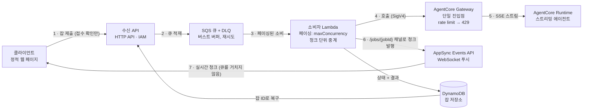

# Amazon Bedrock AgentCore 위의 SQS 버퍼링 스트리밍 에이전트

[English](README.md) | 한국어

**Amazon Bedrock AgentCore 에이전트 앞단에 Amazon SQS를 두어 버스트 요청을 버퍼링하면서도, 모든 클라이언트가 에이전트의 응답을 실시간 스트림으로 받는 패턴의 레퍼런스 구현.**

## 문제

[Amazon Bedrock AgentCore Runtime](https://docs.aws.amazon.com/bedrock-agentcore/latest/devguide/what-is-bedrock-agentcore.html)에서 스트리밍 에이전트를 운영하고, AgentCore Gateway를 단일 진입점으로 두었다고 하자. Gateway는 인증과 rate limit을 제공하지만 — **대기열은 없다**. 이벤트성 버스트(캠페인, 배치 유입, 트래픽 급증)가 도착하면:

- rate limit을 넘는 요청은 `429`로 거부된다 — 누군가는 재시도해야 한다.
- 클라이언트에서 재시도하면 모든 호출자에게 복잡성과 실패 모드가 전가된다.
- 명백한 해법인 "앞단에 큐 두기"는 인터랙티브 에이전트 UX가 포기할 수 없는
  **토큰 단위 스트리밍**을 죽이는 것처럼 보인다.

흔한 가정은 *큐잉과 스트리밍은 양립할 수 없다*는 것이다. 이 샘플은 그렇지 않다는 것을 **측정으로** 보여주기 위해 존재한다.

## 아이디어: 요청 경로와 응답 경로의 분리



요청 경로(1–5)는 버퍼링·페이싱하고, 응답 경로(6–7)는 스트리밍하며 큐를 절대 거치지 않는다.

## 동작 화면


동시성 한도 10에 잡 20건을 한 번에 제출한 화면이다. 상단 스트립은 같은 순간에 스트리밍 중인
잡 개수를 세며 점선(한도)을 절대 넘지 않고, 회색 막대는 큐에서 차례를 기다리는 잡, 파란 점은
에이전트가 방출한 간격 그대로 하나씩 도착하는 청크다. 모든 잡은 결국 완료된다.

[전체 녹화 영상 (41초, 무음)](docs/demo.mp4)

- **요청 경로**는 SQS를 통과한다: 버스트는 유실 없이 흡수되고, 페이싱은 소비자의
  `maximumConcurrency`가 강제하며, `429`는 서버가 알려주는 `retryAfter`를 사용해
  시스템 내부에서 재시도된다.
- **응답 경로**는 큐를 거치지 않는다: 소비자가 Gateway를 통해 에이전트의 SSE 스트림을
  읽고, 청크가 도착하는 즉시 클라이언트의 WebSocket 채널로 중계한다.
- **잡 저장소**가 잡의 수명과 연결의 수명을 분리한다: 스트림 도중 연결이 끊겨도 잡은
  완주하고, 잡 ID로 결과를 되찾을 수 있다.

## 눈으로 확인(그리고 측정)하게 되는 것

1. **큐잉과 스트리밍은 양립한다** — 청크가 마지막에 한꺼번에 몰리지 않고, 에이전트가
   방출한 간격 그대로 클라이언트에 도착한다. 데모 타임라인이 그 리듬을 보여주고,
   수용 테스트가 수치로 판정한다.
2. **버퍼링이 실제로 일어나는 위치** — 잡 30건을 한 번에 제출하면, 메시지 유실 0·DLQ 0을
   유지한 채 소비자 동시성 한도 단위의 웨이브로 처리가 시작되는 것이 관측된다.
3. **스로틀은 오류가 아니라 지연이 된다** — Gateway rate limit을 낮추고 그 이상으로
   몰아넣어도, 클라이언트는 `throttled` 상태 통지와 늦게 시작되는 스트림만 본다.
   완료율은 100%를 유지하고, 모든 `429`는 서버측에서 흡수된다.
4. **연결과 잡의 수명은 분리되어 있다** — 스트림 도중 WebSocket을 끊어도 잡은 완주하고,
   잡 ID로 결과를 조회할 수 있다.

## 사전 요구사항

- `us-west-2`에서 Anthropic Claude Haiku 4.5에 대한
  [Amazon Bedrock 모델 액세스](https://docs.aws.amazon.com/bedrock/latest/userguide/model-access.html)가
  있는 AWS 계정 (또는 `infra/cdk.json`의 `modelId` 변경)
- Node.js 18+ (AWS CDK CLI용), Python 3.11+, Docker (ARM64 이미지 빌드)
- 배포를 위한 관리자 권한의 AWS 자격증명

## 배포

```bash
export AWS_REGION=us-west-2
./scripts/deploy.sh
```

명령 하나로 ARM64 에이전트 컨테이너를 빌드하고, 전체 리소스(SQS + DLQ, DynamoDB,
수신 API, 소비자 Lambda, AgentCore Runtime + Gateway + rate limit, AppSync Events API)를
프로비저닝하며, 엔드포인트를 `outputs/stack-outputs.local.json`에 기록한다.

## 데모 실행

```bash
pip install -r tests/requirements.txt   # 로컬 서버용 boto3 + urllib3
python3 client/serve.py                 # http://127.0.0.1:8765
```

`client/serve.py`가 페이지를 서빙하면서 스택 outputs로 자동 구성하고, 수신 API 호출을
로컬 AWS 자격증명으로 대신 서명한다 — 붙여넣을 것이 없고 자격증명은 브라우저에 절대
들어가지 않는다. 이후:

1. 모의 잡(결정적, 모델 비용 0) 또는 실제 LLM 잡을 버스트로 제출한다.
2. 타임라인을 관찰한다: 행들이 동시성 한도 웨이브로 시작되고, 각 행의 청크 점들이
   에이전트 고유의 리듬으로 전진하며, 스로틀된 행은 경고 마커와 함께 그저 늦게 시작한다.
3. 스트림 도중 **Drop connection**을 누른 뒤 **Reconnect & recover**로 잡 저장소에서
   완료된 결과를 가져온다.

### 각 동작을 의도적으로 관찰하기

- **큐잉·페이싱** — *Jobs to submit*을 소비자 동시성 한도(`maxConcurrency`, 기본 10)보다
  크게 설정한다: 20이면 2개 웨이브, 50이면 5개 웨이브. 각 잡이 스트림 길이만큼 동시성
  슬롯을 점유하므로, *Mock chunks*를 늘리면 웨이브 사이 간격이 벌어져 더 뚜렷해진다.
- **스로틀 흡수** — 잡 수만 늘려서는 절대 발생하지 않는다: 설계상 페이싱이 요청 속도를
  Gateway rate limit 아래로 유지하기 때문이다. 대신 의도적인 불일치를 만든다:

  ```bash
  python3 scripts/throttle_demo.py on    # 한도를 1/분으로, 전파까지 대기
  # 브라우저에서 버스트 제출: 노란 "throttled" 마커가 찍히고, 해당 행은 ~60초 후
  # (서버가 알려준 retryAfter) 시작되며, 모든 잡은 결국 완료된다
  python3 scripts/throttle_demo.py off   # 복원
  ```

대안으로, 이 페이지는 순수 정적 파일로도 동작한다(로컬 서버 없이 `client/index.html`을
직접 열기): `outputs/stack-outputs.local.json` 내용과 임시 자격증명
(`aws configure export-credentials --format env`)을 Connection 폼에 붙여넣으면 되고,
값들은 페이지 메모리에만 머문다.

## 수용 테스트 실행

```bash
pip install -r tests/requirements.txt
python tests/run_scenarios.py        # 시나리오 1-4, 수치 기반 pass/fail
```

| # | 시나리오 | 통과 기준 (측정) |
|---|---|---|
| 1 | 단건 스트리밍 | 전체 청크 전달; 도착 스팬 ≥ 방출 스팬의 0.6배; 최대 간격 ≤ 방출 간격의 4배 |
| 2 | 버스트 버퍼링 (30건) | 30/30 완료, 유실 0, DLQ 0; 피크 동시 스트림 ≤ 한도 |
| 3 | 스로틀 흡수 | Gateway에서 `429` 발생하되 완료율 100%, DLQ 0; 클라이언트는 상태 통지+지연만 경험 |
| 4 | 재접속 복구 | 클라이언트 단절 후에도 잡 완주; 잡 ID로 결과 조회 가능 |

시나리오 3은 `UpdateGatewayRateLimit`으로 Gateway rate limit을 일시적으로 낮췄다가
종료 시 복원한다.

모든 설계 결정의 조사·실측 기록(왜 AppSync Events인지, 왜 `maximumConcurrency`인지,
타임아웃 부등식, Gateway가 `429`에서 실제로 무엇을 반환하는지)은
[docs/DESIGN.md](docs/DESIGN.md)를 참조.

## 한계 — 다른 패턴으로 가야 할 때

| 워크로드가 이렇다면… | 대신 사용할 것 |
|---|---|
| 사용자별 엄격한 순서 보장이 필요 | 사용자별 메시지 그룹의 SQS FIFO (페이싱 모델 조정 필요) |
| 잡당 스트림이 ~13분을 초과 | 컨테이너 소비자 (SQS를 폴링하는 ECS/Fargate) — Lambda 소비자는 호출당 스트림 하나를 15분 타임아웃 안에서 유지하며, AgentCore 스트리밍 자체는 60분까지 허용 |
| 인터랙티브가 아닌 긴 다단계 파이프라인 | [`sample-bedrock-agentcore-async-stepfunctions`](https://github.com/aws-samples/sample-bedrock-agentcore-async-stepfunctions) |
| 트래픽이 낮고 일정하며 버스트 위험이 없음 | 동기 `InvokeAgentRuntime` 스트리밍 직접 호출 — 큐는 지연만 더한다 |
| 수 초의 지연을 허용하고 스트리밍이 불필요 | 잡 저장소에 대한 단순 폴링 |

추가 유의사항:
- 푸시 채널은 재전송(replay)하지 않는다: 클라이언트가 끊긴 동안 발행된 청크는 다시
  전달되지 않으며, 복구는 잡 저장소를 통한다. 청크에는 시퀀스 번호가 있어 클라이언트가
  누락을 감지할 수 있다.
- SQS 중복 전달(표준 큐, at-least-once)은 잡 저장소의 조건부 선점으로 억제되므로,
  같은 스트림이 클라이언트에 두 번 재생되지 않는다.

## 비용

모든 리소스가 종량제이며, 유휴 상태의 배포 비용은 거의 0이다.
활성 시 주요 비용: AgentCore Runtime microVM 초 단위 과금(CPU $0.0895/vCPU-h +
메모리 $0.00945/GB-h; 에이전트가 I/O를 기다리는 동안 CPU는 무과금), Bedrock 모델 토큰
(모의 모드: 0), 스트림을 중계하는 동안의 Lambda 실행 시간, AppSync Events 메시지
(~$1.00/백만 건), SQS 요청. 모의 모드의 전체 수용 테스트 1회 비용은 $1에 한참 못 미친다.
[AgentCore 요금](https://aws.amazon.com/bedrock/agentcore/pricing/) 참조.

## 정리

```bash
./scripts/destroy.sh
```

Lambda와 AgentCore Runtime이 생성하는 로그 그룹을 포함한 모든 스택 리소스를 제거한다.
CDK bootstrap 스택(공유 인프라)과 bootstrap 저장소의 ECR 컨테이너 이미지 에셋은
삭제되지 않으며, 계정에서 CDK를 더 이상 쓰지 않는다면 수동으로 제거한다.

## 보안

- 수신 API는 IAM(SigV4)을 요구한다 — 무인증 배포는 없다.
- AppSync Events API 키는 `connect`/`subscribe`만 허용하며, 발행(publish)은
  소비자 역할만 가진 IAM 권한(`appsync:EventPublish`)을 요구한다.
- Gateway는 IAM을 요구하고 소비자 역할만 호출할 수 있으며, Runtime은 Gateway 역할과
  소비자 역할만 호출할 수 있다.

보안 이슈 제보는 [CONTRIBUTING](CONTRIBUTING.md#security-issue-notifications)을 참조.

## 라이선스

이 라이브러리는 MIT-0 라이선스로 배포된다. [LICENSE](LICENSE) 파일을 참조.
