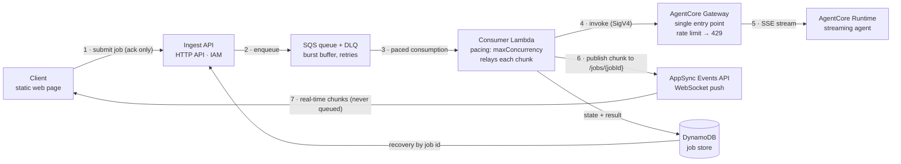
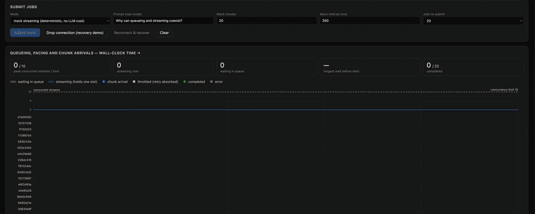

# SQS-buffered streaming agents on Amazon Bedrock AgentCore

English | [한국어](README.ko.md)

**Buffer a burst of requests in front of an Amazon Bedrock AgentCore agent with Amazon SQS — while every client still receives the agent's response as a real-time stream.**

## The problem

You run a streaming agent on [Amazon Bedrock AgentCore Runtime](https://docs.aws.amazon.com/bedrock-agentcore/latest/devguide/what-is-bedrock-agentcore.html), fronted by AgentCore Gateway as its single entry point. Gateway gives you auth and rate limits — **but no queue**. When an event-driven burst arrives (a campaign, a batch import, a traffic spike):

- Requests beyond the rate limit are rejected with `429` — someone has to retry.
- Retrying in the client pushes complexity and failure modes to every caller.
- The obvious fix — putting a queue in front — seems to kill the one thing an
  interactive agent UX cannot lose: **token-by-token streaming**.

The common assumption is that *queueing and streaming are mutually exclusive*. This sample exists to show, with measurements, that they are not.

## The idea: split the request path from the response path



The request path (1–5) buffers and paces; the response path (6–7) streams and
never touches the queue.

## See it running



20 mock jobs submitted in one burst against a concurrency limit of 10. The strip
at the top counts jobs streaming at the same instant and never crosses the dashed
limit; the grey bars are jobs waiting their turn in the queue; the blue dots are
chunks arriving one by one, spaced as the agent emitted them. Every job completes.

[Full recording (41s, silent)](docs/demo.mp4)

- The **request path** goes through SQS: bursts are absorbed losslessly, pacing is
  enforced by the consumer's `maximumConcurrency`, and `429`s are retried inside
  the system using the server-provided `retryAfter`.
- The **response path** never touches the queue: the consumer reads the agent's
  SSE stream through Gateway and relays every chunk to the client's WebSocket
  channel the moment it arrives.
- A **job store** decouples job lifetime from connection lifetime: drop the
  connection mid-stream and the job still finishes; fetch the result by job id.

## What you will see (and measure)

1. **Queueing and streaming coexist** — chunks arrive at the client spaced like
   the agent emitted them, not in one clump at the end. The demo timeline makes
   the cadence visible; the acceptance tests assert it numerically.
2. **Where buffering actually happens** — submit 30 jobs at once and watch them
   start in waves of the consumer concurrency limit while zero messages are lost
   and the DLQ stays empty.
3. **Throttling becomes latency, not errors** — lower the Gateway rate limit,
   burst past it, and the client sees only a `throttled` status followed by a
   late-starting stream. Completion stays 100%; every `429` is absorbed
   server-side.
4. **Connections and jobs have separate lifetimes** — kill the WebSocket
   mid-stream; the job completes and the result is retrievable by job id.

## Prerequisites

- AWS account with [Amazon Bedrock model access](https://docs.aws.amazon.com/bedrock/latest/userguide/model-access.html)
  to Anthropic Claude Haiku 4.5 in `us-west-2` (or set `modelId` in `infra/cdk.json`)
- Node.js 18+ (for the AWS CDK CLI), Python 3.11+, Docker (ARM64 image build)
- AWS credentials with administrative permissions for deployment

## Deploy

```bash
export AWS_REGION=us-west-2
./scripts/deploy.sh
```

One command builds the ARM64 agent container, provisions everything
(SQS + DLQ, DynamoDB, ingest API, consumer Lambda, AgentCore Runtime + Gateway +
rate limit, AppSync Events API), and writes endpoints to
`outputs/stack-outputs.local.json`.

## Run the demo

```bash
pip install -r tests/requirements.txt   # boto3 + urllib3 for the local server
python3 client/serve.py                 # http://127.0.0.1:8765
```

`client/serve.py` serves the page, auto-configures it from the stack outputs,
and signs ingest calls with your local AWS credentials — nothing to paste and
no credentials ever enter the browser. Then:

1. Submit a burst of mock jobs (deterministic, zero model cost) or real LLM jobs.
2. Watch the timeline: rows start in concurrency-limit waves; each row's chunk
   dots advance at the agent's own cadence; throttled rows show a warning marker
   and simply start late.
3. Press **Drop connection** mid-stream, then **Reconnect & recover** to fetch
   the finished result from the job store.

### Seeing each behavior on purpose

- **Queuing and pacing** — set *Jobs to submit* above the consumer concurrency
  limit (`maxConcurrency`, 10 by default): 20 gives two waves, 50 gives five.
  Raise *Mock chunks* to widen the gap between waves, since each job holds one
  concurrency slot for the length of its stream.
- **Throttle absorption** — job count alone will never trigger it: pacing keeps
  the request rate under the Gateway rate limit by design. Create a deliberate
  mismatch instead:

  ```bash
  python3 scripts/throttle_demo.py on    # limit -> 1/minute, waits for propagation
  # submit a burst in the browser: yellow "throttled" markers, those rows start
  # ~60s later (the server's retryAfter), and every job still completes
  python3 scripts/throttle_demo.py off   # restore
  ```

Alternatively the page also works as a plain static file (open
`client/index.html` directly, no local server): paste the contents of
`outputs/stack-outputs.local.json` plus temporary credentials
(`aws configure export-credentials --format env`) into the Connection form —
they stay in page memory only.

## Run the acceptance tests

```bash
pip install -r tests/requirements.txt
python tests/run_scenarios.py        # scenarios 1-4, numbers-based pass/fail
```

| # | Scenario | Pass criteria (measured) |
|---|---|---|
| 1 | Single-job streaming | all chunks delivered; arrival span ≥ 0.6× emission span; max gap ≤ 4× emission interval |
| 2 | Burst buffering (30 jobs) | 30/30 completed, 0 lost, DLQ 0; peak concurrent streams ≤ limit |
| 3 | Throttle absorption | `429`s observed at the gateway, yet 100% completion, DLQ 0; client sees status + delay only |
| 4 | Reconnect recovery | job completes after client disconnect; result retrievable by job id |

Scenario 3 temporarily lowers the Gateway rate limit through
`UpdateGatewayRateLimit` and restores it afterwards.

See [docs/DESIGN.md](docs/DESIGN.md) for the research and measurements behind
every design decision (why AppSync Events, why `maximumConcurrency`, the
timeout inequalities, what the Gateway actually returns on `429`).

## Limitations — when to use something else

| If your workload… | Use instead |
|---|---|
| Needs strict per-user ordering | SQS FIFO with message-group-per-user (adjust pacing model) |
| Streams longer than ~13 minutes per job | A container consumer (ECS/Fargate polling SQS) — the Lambda consumer holds one stream per invocation, bounded by its 15-minute timeout; AgentCore streaming itself allows 60 minutes |
| Is a long multi-step pipeline, not interactive | [`sample-bedrock-agentcore-async-stepfunctions`](https://github.com/aws-samples/sample-bedrock-agentcore-async-stepfunctions) |
| Has low, steady traffic and no burst risk | Direct synchronous `InvokeAgentRuntime` streaming — a queue only adds latency |
| Can tolerate seconds of delay and no streaming | Simple polling on the job store |

Also note:
- The push channel does not replay: chunks published while a client is
  disconnected are not re-delivered — recovery goes through the job store.
  Chunks carry sequence numbers so clients can detect gaps.
- A duplicate SQS delivery (standard queue, at-least-once) is suppressed by a
  conditional claim in the job store, so a stream is never replayed to a client.

## Cost

Everything is pay-per-use; an idle deployment costs almost nothing.
Dominant costs when active: AgentCore Runtime microVM seconds
(CPU $0.0895/vCPU-h + memory $0.00945/GB-h; CPU is not billed while the agent
waits on I/O), Bedrock model tokens (mock mode: zero), Lambda duration while
relaying streams, AppSync Events messages (~$1.00/million), and SQS requests.
A full acceptance-test run in mock mode costs well under $1.
See [AgentCore pricing](https://aws.amazon.com/bedrock/agentcore/pricing/).

## Clean up

```bash
./scripts/destroy.sh
```

Removes every stack resource, including the log groups the Lambdas and the
AgentCore Runtime create. The CDK bootstrap stack (shared) and the ECR container
image assets in the bootstrap repository are not deleted; remove those manually
if you no longer use CDK in the account.

## Security

- The ingest API requires IAM (SigV4) — no unauthenticated deployment.
- The AppSync Events API key only permits `connect`/`subscribe`; publishing
  requires IAM (`appsync:EventPublish`), held by the consumer role only.
- The Gateway requires IAM and only the consumer role may invoke it; the
  Runtime is invocable only by the Gateway role and the consumer role.

See [CONTRIBUTING](CONTRIBUTING.md#security-issue-notifications) for reporting
security issues.

## License

This library is licensed under the MIT-0 License. See the [LICENSE](LICENSE) file.
